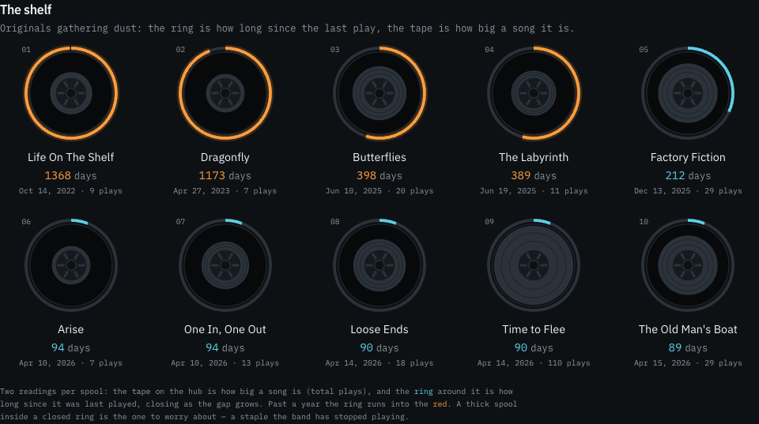
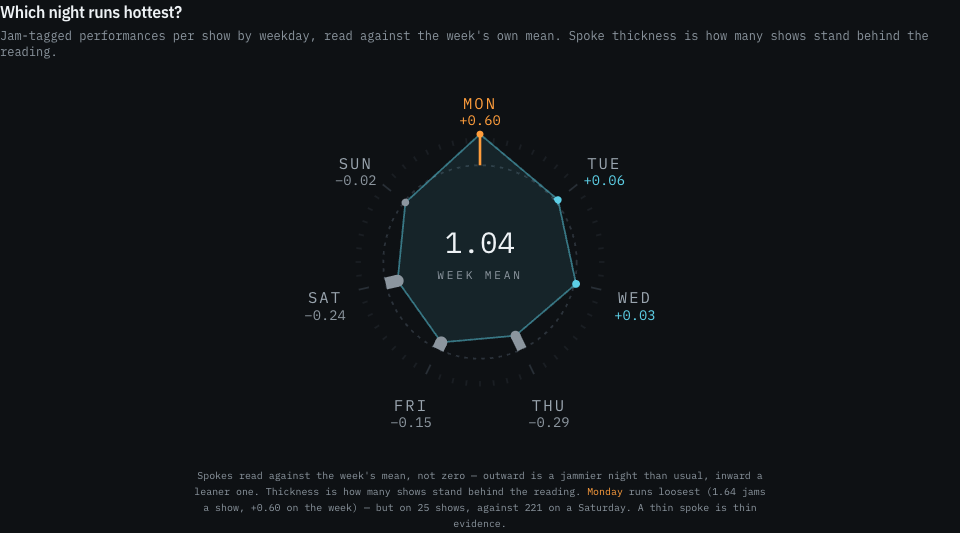
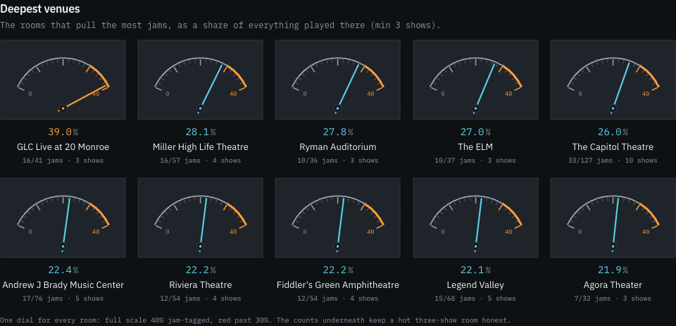
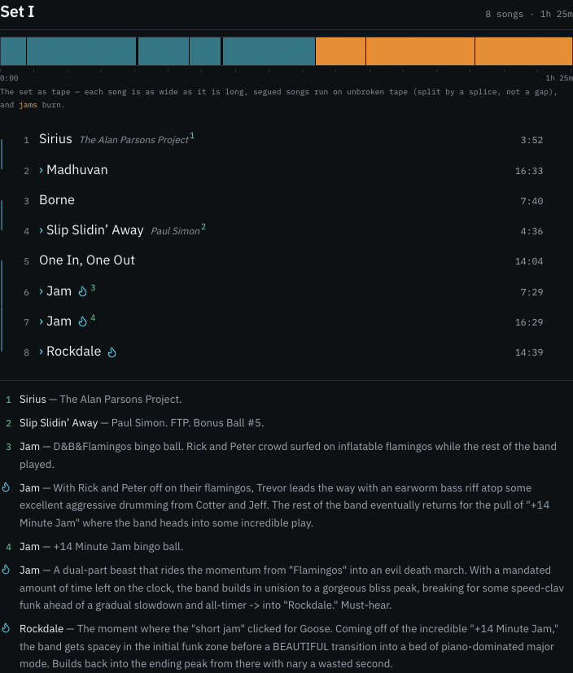

<div align="center">


# Goose Index

**Every [Goose](https://www.goosetheband.com) show, every night.**
Setlists with segues and jams, songs, venues, tours — and statistics that don't overstate what the numbers say.

[**www.gooseindex.com**](https://www.gooseindex.com)

[](https://github.com/tsvb/goose-index/actions/workflows/ci.yml)
[](https://github.com/tsvb/goose-index/actions/workflows/sync.yml)


[](LICENSE)

</div>

---

## The charts are the point

The statistics pages don't use a chart library. Every mark is hand-rolled SVG, because
**each question gets the form its number actually is** — a duration is drawn as a length, a
cycle as a dial, a level as a meter.

<table>
<tr>
<td width="50%">

**The shelf** — originals gathering dust. The ring is how long since the last play; the tape
on the hub is how big a song is. A thick spool inside a closed ring is a staple the band has
stopped playing.

</td>
<td width="50%">

**Which night runs hottest?** — jams per show by weekday, read against the week's own mean.
Spoke *thickness* is how many shows stand behind each reading, because the hottest night
rests on far fewer shows than the quietest one.

</td>
</tr>
<tr>
<td></td>
<td></td>
</tr>
<tr>
<td width="50%">

**Deepest venues** — jam share is a level, so it gets a needle, a scale, and a red zone. The
play counts stay in text underneath, so three hot shows can't fake a deep room.

</td>
<td width="50%">

**The setlist as tape** — each song is as wide as it is long, and a segued run is unbroken
tape. The shape of a night is visible without reading twenty-four track times.

</td>
</tr>
<tr>
<td></td>
<td></td>
</tr>
</table>

Three rules hold across all of them. **A change that breaks one is a bug, even if it renders.**

1. **Each question gets the form its number is.** Duration → length. Cycle → dial. Sequence →
   setlist notation. Level → meter. Gap → a closing ring.
2. **Colour means exactly one thing per section.** On The Shelf it means *how long since the
   last play* — which is why the tape is graphite and only the ring is lit. Ink follows
   significance: the song that most deserves your attention carries the most of it.
3. **A claim never travels without its evidence.** Skewed data is log-scaled (gaps span
   88–1367 days). Where the data is too thin to be honest about, the chart draws nothing
   rather than something misleading.

---

## What it does

| | |
|---|---|
| **Shows** | Every show, with full setlists — segues, jams, track times, footnotes — plus the tape above. |
| **Songs** | Per-song history: every performance, gaps, debuts, bust-outs, covers. |
| **Stats** | Six cuts — Most Played, Rarities, Most Overdue, Debuts, Set Stats, and [Oracle](https://www.gooseindex.com/stats/oracle). |
| **Browse** | By venue, tour, year, and On This Day. Full-text search. |
| **Live** | While a show is on stage, the setlist re-pulls from elgoose and the page refreshes itself. |

Scale, as of 2026-07-13: **823 shows** played (from 2014-09-27), **615 songs**, **592 venues**,
**7,504 performances**. These grow nightly — live counts are on [/stats](https://www.gooseindex.com/stats).

## Three editions, four themes

Every page renders in one of three editions, chosen from the gear in the header and remembered
per visitor:

| Edition | What you get |
|---|---|
| **3.0** | Charts, themes, motion. The default. |
| **2.0** | The same charts, in a glossy Web 2.0 skin. No themes, no motion. |
| **1.0** | A plain document. Tables, no charts. |

3.0 carries four themes — **XL II** (the default: graphite chassis, chrome accent, one warm
filament), Dark, Light, and Pod.

## Architecture

```
elgoose.net ──(nightly Action: npm run sync)──▶ Neon Postgres ◀──(reads)── Vercel (Next.js) ──▶ visitors
```

The web app only ever **reads** at request time. Every write happens out of band in the sync
job, so page loads never depend on the elgoose API being up.

- **Next.js (App Router) + TypeScript** — server-rendered. No client-side charting library; every
  chart is SVG against design tokens, so it reskins with the theme.
- **Postgres + Drizzle** — a cached copy of the live-performance record.
- **Vitest** — the suite runs fully offline (fixtures + in-memory PGlite). No network, no database.
- **Vercel Web Analytics** — cookieless page views, on every edition.

<details>
<summary><b>Getting started</b></summary>

<br>

Needs Node 22+ and Docker (or a native Postgres 16).

```bash
npm install
npm run db:up        # local Postgres via docker compose
npm run db:migrate
npm run sync         # pull elgoose.net -> Postgres
npm run verify       # expect: VERIFY OK
npm run dev          # http://localhost:3000
```

Checks: `npm test` (offline) and `npm run typecheck`.

The band's liner notes ("From the coach's desk") come from Bandcamp via a separate pipeline —
the site works without them. Full detail in [`docs/SETUP.md`](docs/SETUP.md).

</details>

<details>
<summary><b>Deployment</b></summary>

<br>

Vercel (Next.js) reading from Neon (managed Postgres). Full runbook in [`docs/DEPLOY.md`](docs/DEPLOY.md).
Two things worth knowing up front:

- **Production builds migrate before they build.** `vercel-build` runs `db:migrate && next build`,
  so the schema can't lag the code that depends on it. A bad migration fails the deploy instead of
  shipping a broken route.
- **Preview builds deliberately do not migrate.** Previews read the *production* database, so
  letting them migrate would let any pushed branch alter the production schema before review. A
  preview of a schema-changing branch will 500 on the new route until it merges. That's expected.

</details>

<details>
<summary><b>Roadmap</b></summary>

<br>

| Phase | | Status |
|---|---|---|
| **0** | Data foundation — sync elgoose → Postgres, verified | done |
| **1** | Shows & discovery — setlists, search, On This Day, upcoming | done |
| **2** | Songs & stats — per-song pages, song index, `/stats` cuts | done |
| **3** | Jam & set-flow analytics — segue lines, jam density by night and venue, the shelf | Oracle ships the first cut; era-aware analysis still open |
| 4 | Fan tracking — shows I've seen, personal stats, song life-list | planned |

Design specs per phase: [`docs/superpowers/specs/`](docs/superpowers/specs/).

</details>

---

## Data source and attribution

> **Non-commercial fan project, not affiliated with Goose.**

Live-performance data comes from the community database at [elgoose.net](https://elgoose.net)
(the keyless [v2 API](https://elgoose.net/api/docs.php)), is cached locally, and is credited on
every page. Show notes under "From the coach's desk" are the band's own liner notes, scraped from
their official [Bandcamp](https://goosetheband.bandcamp.com) releases — see
[`scripts/README-bandcamp.md`](scripts/README-bandcamp.md).

Inspired in spirit by [dmbalmanac.com](https://dmbalmanac.com). Full data landscape:
[`docs/research/2026-06-26-data-landscape.md`](docs/research/2026-06-26-data-landscape.md).

## License

The **code** is [MIT](LICENSE).

The **data** is not mine to license. Setlists, shows, venues and songs belong to the elgoose
community; the coach's notes belong to the band. MIT covers what's in this repository and
nothing more — see [`NOTICE`](NOTICE).
